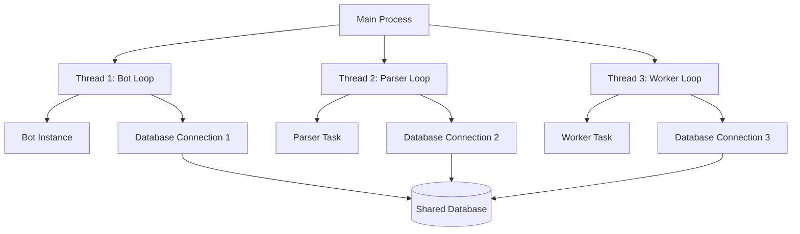

# New Architecture Design: Separate Asyncio Loops

## Current Issues
1. Shared database session maker across threads (not thread-safe)
2. Global bot instances in worker and parser modules
3. Inefficient thread management

## Proposed Solution
Run three independent asyncio loops in separate threads:
1. **Bot Loop** - Main thread
2. **Parser Loop** - Separate thread
3. **Worker Loop** - Separate thread

## Architecture Diagram



## Implementation Plan

### 1. Database Management
- Create a function to initialize database engine and session maker for each thread
- Each thread will have its own engine and session maker
- All engines connect to the same database

### 2. Thread Management
- Use `asyncio.new_event_loop()` and `loop.run_until_complete()` for each thread
- Properly handle thread lifecycle and cleanup

### 3. Component Modifications
- Parser: Remove global bot instance, create local one
- Worker: Remove global bot instance, create local one
- Sending Messages: Remove global bot instance, pass as parameter

## File Structure Changes
```
main.py          # Main entry point, thread management
db.py            # Database utilities, engine creation function
parser/parser.py # Parser logic with local event loop
bot/subscription_worker.py # Worker logic with local event loop