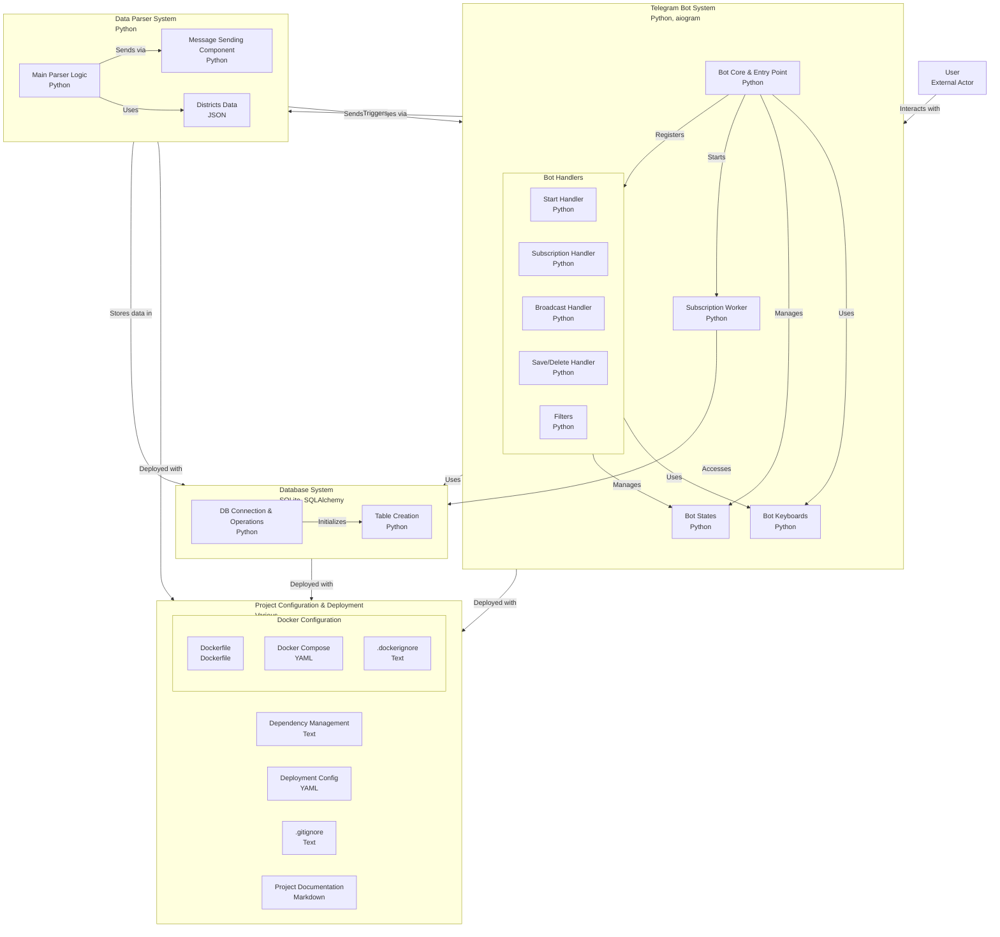

# Telegram Apartment Bot

Этот проект — Telegram-бот, который помогает пользователям находить квартиры по заданным параметрам (цена, количество комнат, район, срок аренды, меблировка), собирая данные с Bayut.com и уведомляя подписчиков о подходящих объявлениях.

## Возможности
- **Интерактивность**: Пользователи выбирают параметры через инлайн-клавиатуры и сохраняют их в базу данных PostgreSQL.
- **Сбор данных**: Бот парсит объявления о квартирах с Bayut.com, сохраняя цену, комнаты, район и фото.
- **Уведомления**: Отправляет уведомления пользователям с активной подпиской при появлении подходящих объявлений.
- **Проверка подписки**: Уведомления получают только пользователи с активной подпиской (`status="active)`.


## Установка
1. **Зависимости**: Установите зависимости из `requirements.txt`:
   ```bash
   pip install -r requirements.txt
   ```
2. **База данных**: PostgreSQL с таблицами `apartments`, `clients` и `subscriptions`. Таблицы создаются самостоятельно с помощью create_table.py, если еще не созданы.
3. **Telegram-бот**: Создайте бота через BotFather, укажите токен в переменных окружения или конфиге.
4. **Запуск**: Запустите `main.py`:
   ```bash
   python main.py
   ```

## Использование
1. Запустите бота командой `/start`.
2. Выберите параметры (район, комнаты, диапазон цен и т.д.) через инлайн-клавиатуры.
3. Сохраните параметры кнопкой "Сохранить". Убедитесь, что подписка активна.
4. Получайте уведомления о подходящих квартирах при активной подписке.

## Архитектура проекта



