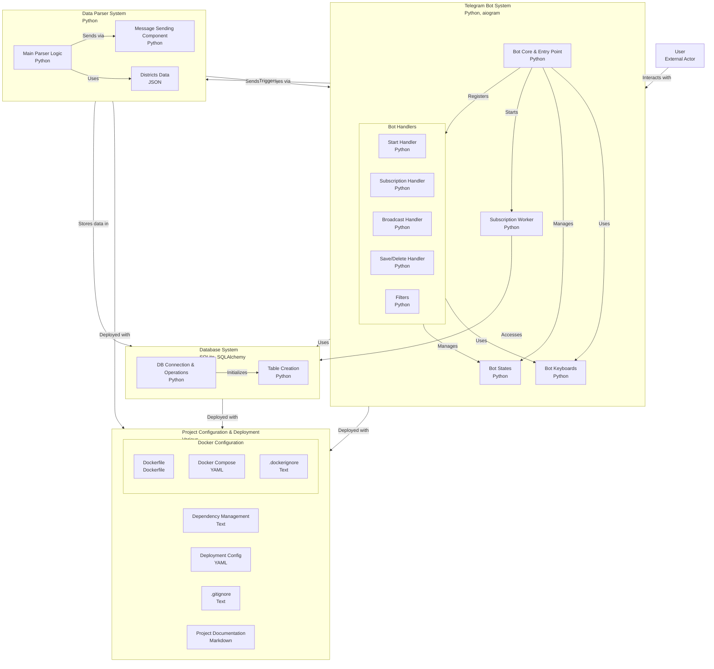
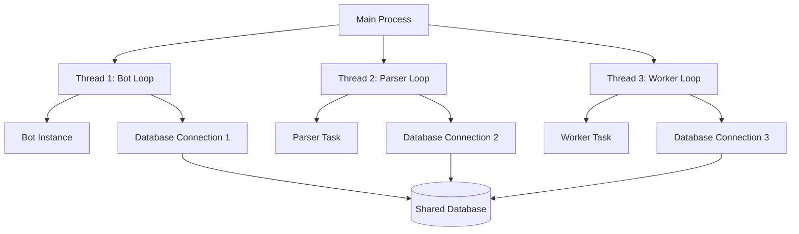

# Telegram Apartment Bot  
t.me/FindApartmentsBot
Telegram-бот, который помогает пользователям находить квартиры по заданным параметрам (цена, количество комнат, район, срок аренды, меблировка), собирая данные с **Bayut.com** и уведомляя подписчиков о подходящих объявлениях.  

## Возможности  
- **Интерактивность** — выбор параметров через инлайн-клавиатуры и сохранение их в PostgreSQL.  
- **Сбор данных** — парсинг объявлений с Bayut.com с ценой, количеством комнат, районом и фото.  
- **Уведомления** — отправка подходящих предложений пользователям с активной подпиской.  
- **Проверка подписки** — уведомления только для пользователей со статусом `active`.  

  
  

## Установка  
1. **Зависимости**  
   ```bash
   pip install -r requirements.txt
   ```  
2. **База данных** — PostgreSQL с таблицами `apartments`, `clients`, `subscriptions`. Таблицы создаются через `create_table.py`.  
3. **Запуск**  
   ```bash
   python main.py
   ```  


## Архитектура проекта



## Proposed Solution
Run three independent asyncio loops in separate threads:
1. **Bot Loop** - Main thread
2. **Parser Loop** - Separate thread
3. **Worker Loop** - Separate thread

## Architecture Diagram



## Implementation Plan

### 1. Database Management
- Create a function to initialize database engine and session maker for each thread
- Each thread will have its own engine and session maker
- All engines connect to the same database

### 2. Thread Management
- Use `asyncio.new_event_loop()` and `loop.run_until_complete()` for each thread
- Properly handle thread lifecycle and cleanup

### 3. Component Modifications
- Parser: Remove global bot instance, create local one
- Worker: Remove global bot instance, create local one
- Sending Messages: Remove global bot instance, pass as parameter

## File Structure Changes
```
main.py          # Main entry point, thread management
db.py            # Database utilities, engine creation function
parser/parser.py # Parser logic with local event loop
bot/subscription_worker.py # Worker logic with local event loop